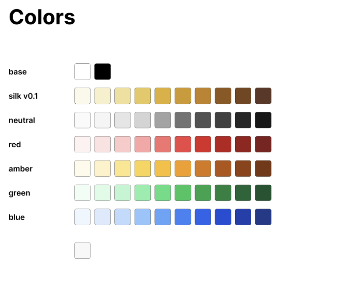

# Silk Brand Kit
By Holonym Foundation

## Design System [Colors]
### Base
White -- FFFFFF
Black -- 000000
### Silk v0.1
color/silk/050 -- FBF9EB
color/silk/100 -- F7F0CA
color/silk/200 -- F1DF97
color/silk/300 -- E8C85C
color/silk/400 -- E0AF2F
color/silk/500 -- D09922
color/silk/600 -- C3811D
color/silk/700 -- 8F5619
color/silk/800 -- 77451C
color/silk/900 -- 5D3726
### Neutral
color/neutral/050 -- FAFAFA
color/neutral/100 -- F5F5F5
color/neutral/200 -- E5E5E5
color/neutral/300 -- D4D4D4
color/neutral/400 -- A3A3A3
color/neutral/500 -- 737373
color/neutral/600 -- 525252
color/neutral/700 -- 404040
color/neutral/800 -- 262626
color/neutral/900 -- 171717
### Red
color/red/050 -- FEF2F2
color/red/100 -- FEE2E2
color/red/200 -- FECACA
color/red/300 -- FCA5A5
color/red/400 -- F87171
color/red/500 -- EF4444
color/red/600 -- DC2626
color/red/700 -- B91C1C
color/red/800 -- 991B1B
color/red/900 -- 7F1D1D
### Amber
color/amber/050 -- FFFBEB
color/amber/100 -- FEF3C7
color/amber/200 -- FDE68A
color/amber/300 -- FCD34D
color/amber/400 -- FBBF24
color/amber/500 -- F59E0B
color/amber/600 -- D97706
color/amber/700 -- B45309
color/amber/800 -- 92400E
color/amber/900 -- 78350F
### Green
color/green/050 -- F0FDF4
color/green/100 -- DCFCE7
color/green/200 -- BBF7D0
color/green/300 -- 86EFAC
color/green/400 -- 4ADE80
color/green/500 -- 22C55E
color/green/600 -- 16A34A
color/green/700 -- 15803D
color/green/800 -- 166534
color/green/900 -- 14532D
### Blue
color/blue/050 -- EFF6FF
color/blue/100 -- DBEAFE
color/blue/200 -- BFDBFE
color/blue/300 -- 93C5FD
color/blue/400 -- 60A5FA
color/blue/500 -- 3B82F6
color/blue/600 -- 2563EB
color/blue/700 -- 1D4ED8
color/blue/800 -- 1E40AF
color/blue/900 -- 1E3A8A